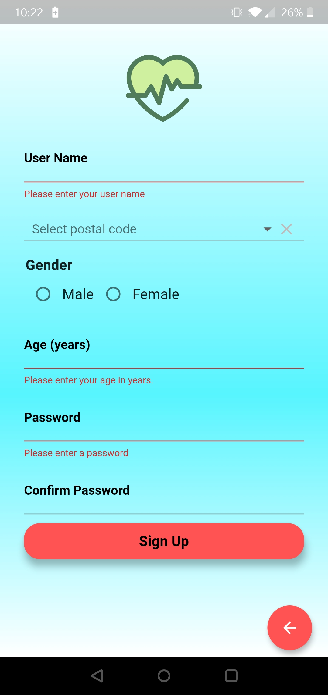

# Covid19Tracker
* This repository contains the screen-recording of the working prototype we have built for the COVID-19 monitoring, primarily in a particular city. The application is still in progress.
* Developed using Flutter and Firebase

Here are some example screenshots for the app:

  
  
  
  
  
  
  
  
  
  
  
  
  
  
  
  
  
  
  

 
